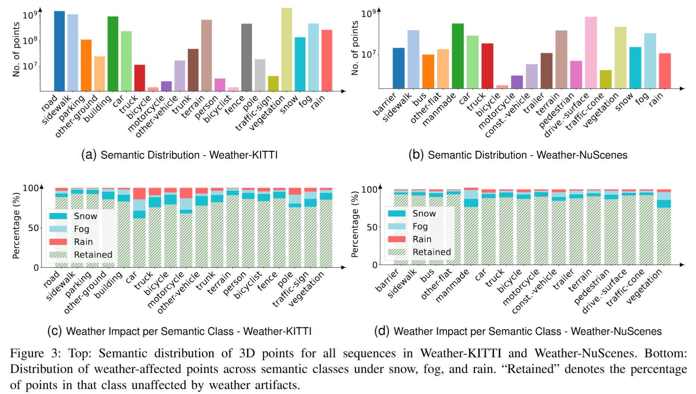
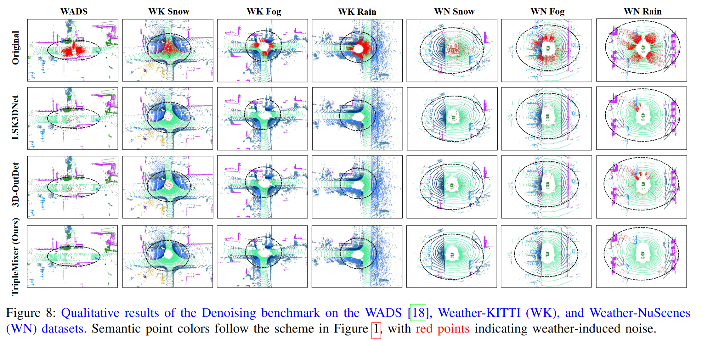
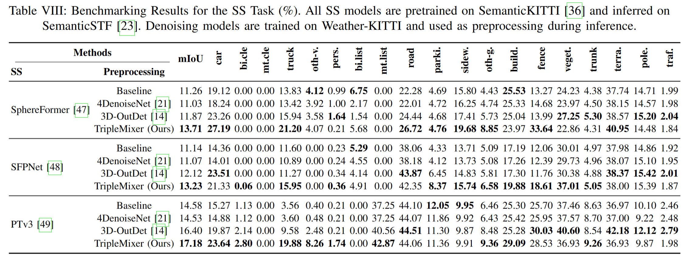
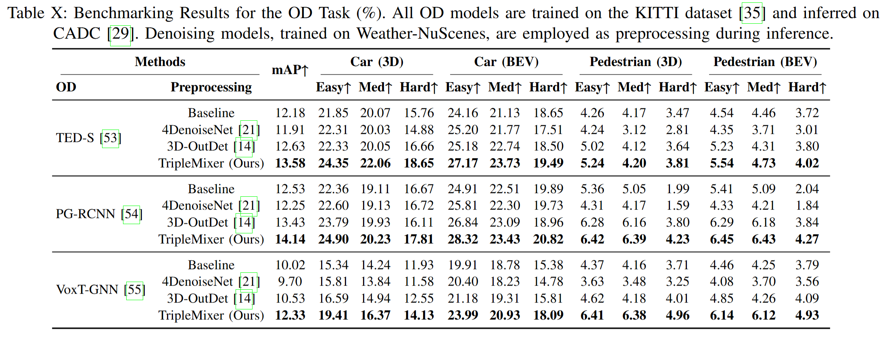

<p align="center">
  
  
  <h3 align="center"><strong>TripleMixer: A 3D Point Cloud Denoising Model for Adverse Weather</strong></h3>

  <p align="center">
      <a href="https://scholar.google.com.sg/citations?user=miv8T6MAAAAJ&hl=zh-CN" target='_blank'>Xiongwei Zhao</a><sup>1*</sup>&nbsp;&nbsp;&nbsp;
      <a href="https://scholar.google.com.sg/citations?user=OTBgvCYAAAAJ&hl=zh-CN&oi=ao" target='_blank'>Congcong Wen</a><sup>2,3*</sup>&nbsp;&nbsp;&nbsp;
      <a href="https://scholar.google.com.sg/citations?user=VWjvfjkAAAAJ&hl=zh-CN" target='_blank'>Xu Zhu</a><sup>1#</sup>&nbsp;&nbsp;&nbsp;
      <a href="" target='_blank'>Yang Wang</a><sup>1</sup>&nbsp;&nbsp;&nbsp;
      <a href="https://www.researchgate.net/profile/Haojie-Bai" target='_blank'>Haojie Bai</a><sup>1</sup>&nbsp;&nbsp;&nbsp;
      <a href="https://scholar.google.com.sg/citations?user=WMyb00gAAAAJ&hl=zh-CN&oi=ao" target='_blank'>Wenhao Dou</a><sup>1</sup>
    <br>
  <sup>1</sup>Harbin Institute of Technology&nbsp;&nbsp;&nbsp;
  <sup>2</sup>Harvard University&nbsp;&nbsp;&nbsp;
  <sup>3</sup>New York University
  </p>

</p>


<p align="center">
  <a href="https://www.arxiv.org/pdf/2408.13802" target='_blank'>
    
  </a>
  
  <a href="https://github.com/Grandzxw/TripleMixer/stargazers" target='_blank'>
    
  </a>

  <a href="" target='_blank'>
    
  </a>

</p>


## Abstract
Adverse weather conditions such as snow, fog, and rain pose significant challenges to LiDAR-based perception models by introducing noise and corrupting point cloud measurements. To address this issue, we make the following three contributions:
1. **Point cloud denoising network:** we propose **TripleMixer**, a robust and efficient point cloud denoising network that integrates spatial, frequency, and channel-wise processing through three specialized mixer modules. TripleMixer can be seamlessly deployed as a plug-and-play module within existing LiDAR perception pipelines;
2. **Large-scale adverse weather datasets:** we construct two large-scale simulated datasets, **Weather-KITTI** and **Weather-NuScenes**, covering diverse weather scenarios with dense point-wise semantic and noise annotations;
3. **LiDAR perception benchmarks:** we establish four benchmarks: **Denoising**, **Semantic Segmentation (SS)**, **Place Recognition (PR)**, and **Object Detection (OD)**. These benchmarks enable systematic evaluation of denoising generalization, transferability, and downstream impact under both simulated and real-world adverse weather conditions.


## Updates
* 08/22/2025: All codes and configurations have been updated!
* 12/26/2024: The Weather-KITTI and Weather-NuScenes datasets are publicly available on the BaiduPan platform!   
  - **Weather-KITTI:** [Download link](https://pan.baidu.com/s/1lwkIWwiLvtaM2SDKfT0SCg) (code: `xxr1`)  
  - **Weather-NuScenes:** [Download link](https://pan.baidu.com/s/1Qhr4I15W5IuamLC7gZTL8g) (code: `musq`)  
* 24/08/2024: Initial release and submitted to the Journal. The dataset will be open source soon!


## Outline
- [Dataset](#dataset)
- [Denoising Network](#denoising-network)
- [LiDAR Perception Benchmarks](#liDAR-perception-benchmarks)
- [Installation](#installation)
- [Training and Evaluation](#training-and-evaluation)
- [Dataset Generation](#dataset-generation)
- [Citation](#citation)
- [License](#license)
- [Acknowledgements](#acknowledgements)


## Dataset

### 1) Overview

Our **Weather-KITTI** and **Weather-NuScenes** are based on the [SemanticKITTI](https://www.semantic-kitti.org/) and [nuScenes-lidarseg](https://www.nuscenes.org/) datasets, respectively. These datasets cover three common adverse weather conditions: rain, fog, and snow and retain the original LiDAR acquisition information and provide point-level semantic labels for rain, fog, and snow. The visualization results are shown below:

<p align="center">  </p>

### 2) Dataset Statistics

<p align="center">  </p>
<p align="center">  </p>


## Denoising Network
### 1) Overview

We propose **TripleMixer**, a plug-and-play point cloud denoising network that integrates spatial, frequency, and channel-wise processing through three specialized mixer layers. TripleMixer enables interpretable and robust denoising under adverse weather conditions, and can be seamlessly integrated into existing LiDAR perception pipelines to enhance their robustness. The overview of the proposed TripleMixer denoising network is shown below:

<p align="center">  </p>

### 2) Results Visualization

<p align="center">  </p>


## LiDAR Perception Benchmarks
We establish a Denoising benchmark to evaluate the performance of **our denoising model** and introduce three downstream LiDAR perception benchmarks: **Semantic Segmentation (SS)**, **Place Recognition (PR)**, and **Object Detection (OD)**, to assess the generalization of state‑of‑the‑art perception models under adverse weather and the effectiveness of our denoising model as a preprocessing step. Notably, in all downstream benchmarks, our denoising model is trained in a supervised manner solely on our Weather‑KITTI and Weather‑NuScenes datasets using only point‑wise weather labels. Meanwhile, all perception models are directly tested on real‑world adverse‑weather datasets without any retraining or fine‑tuning. 

### 1) Denoising

<p align="center">  </p>
<p align="center">  </p>


### 2) Semantic Segmentation (SS)
* Segmentation model selection: 
  - **[SphereFormer](https://arxiv.org/pdf/2303.12766), CVPR 2023.** <sup>[**`[Code]`**](https://github.com/dvlab-research/SphereFormer)</sup>,
  - **[SFPNet](https://arxiv.org/pdf/2407.11569), ECCV 2024.** <sup>[**`[Code]`**](https://github.com/Cavendish518/SFPNet)</sup>,
  - **[PointTransformerV3](https://arxiv.org/pdf/2312.10035), CVPR 2024.** <sup>[**`[Code]`**](https://github.com/Pointcept/PointTransformerV3)</sup>,

* Benchmarks Results: 
<p align="center">  </p>


### 3) Place Recognition (PR)
* Place Recognition model selection: 
  - **[OT](https://arxiv.org/pdf/2203.03397), IROS 2022.** <sup>[**`[Code]`**](https://github.com/haomo-ai/OverlapTransformer)</sup>,
  - **[CVTNet](https://ieeexplore.ieee.org/document/10273716), TII 2023.** <sup>[**`[Code]`**](https://github.com/BIT-MJY/CVTNet)</sup>,
  - **[LPSNet](https://arxiv.org/pdf/2312.10035), ICRA 2024.** <sup>[**`[Code]`**](https://github.com/Yavinr/LPS-Net)</sup>,

* Benchmarks Results: 
<p align="center">  </p>


### 3) Object Detection (OD)
* Detection model selection: 
  - **[TED-S](https://arxiv.org/abs/2211.11962), AAAI 2023.** <sup>[**`[Code]`**](https://github.com/hailanyi/TED)</sup>,
  - **[PG-RCNN](https://openaccess.thecvf.com/content/ICCV2023/papers/Koo_PG-RCNN_Semantic_Surface_Point_Generation_for_3D_Object_Detection_ICCV_2023_paper.pdf), ICCV 2023.** <sup>[**`[Code]`**](https://github.com/quotation2520/PG-RCNN)</sup>,
  - **[VoxT-GNN](https://www.sciencedirect.com/science/article/pii/S0306457325000962), IPM 2025.** <sup>[**`[Code]`**](https://github.com/tusifpk/VoxT-GNN)</sup>,

* Benchmarks Results: 
<p align="center">  </p>


## Installation


## Training and Evaluation

## Dataset Generation


## Citation
If you find our work useful in your research, please consider citing:
```bibtex
@misc{zhao2024triplemixer3dpointcloud,
      title={TripleMixer: A 3D Point Cloud Denoising Model for Adverse Weather}, 
      author={Xiongwei Zhao and Congcong Wen and Yang Wang and Haojie Bai and Wenhao Dou},
      year={2024},
      eprint={2408.13802},
      archivePrefix={arXiv},
      primaryClass={cs.CV},
      url={https://arxiv.org/abs/2408.13802}, 
}
```


## License
The dataset is based on the [SemanticKITTI](https://www.semantic-kitti.org/) dataset, provided under the [Creative Commons Attribution-NonCommercial-ShareAlike 3.0 United States License (CC BY-NC-SA 3.0 US)](https://creativecommons.org/licenses/by-nc-sa/3.0/us/), and the [nuScenes-lidarseg](https://www.nuscenes.org/) dataset, provided under the [Creative Commons Attribution-NonCommercial-ShareAlike 4.0 International License (CC BY-NC-SA 4.0)](https://creativecommons.org/licenses/by-nc-sa/4.0/). This dataset is provided under the terms of the [Creative Commons Attribution-NonCommercial-ShareAlike 4.0 International License (CC BY-NC-SA 4.0)](https://creativecommons.org/licenses/by-nc-sa/4.0/).


## Acknowledgements
